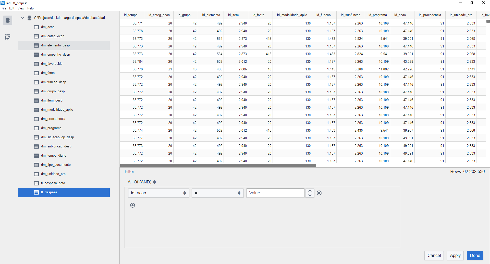

# DuckDB

## Capacidades

"_DuckDB is the SQLite for Analytics._"


- Consegue rodar comandos SQL em um dataframe pandas diretamente.
- Pode carregar dados de arquivos CSV compactados como gzip diretamente, que é o caso do portal dados mg.
- Is highly optimized for analytical query workloads (OLAP). Because it is columnar-oriented DB.
- Ao invés de usar pandas e numpy para carregar e tratar dados, DuckDB faz isso com todas as vantagens de se usar um RDBMS.
- Não necessita de interfaces client/server e não possui dependencias externas.

## Limitações
	- Foi desenvolvido para rodar em **uma máquina somente**.
	- **Não** se trata de uma multi-tenant database. Cada usuário tem de ter sua cópia da base de dados (o uso de  Airflow, S3, Parquet and DBT pode mitigar essas limitações).
	- Não deve ser usada como base de dados transacional. No caso deste projeto a construição de um data warehouse não enseja nessa necessidade.

Para o projeto em questão, o DuckDB parece se adequar mais que o SQLite, por ser [otimizado para uso em aplicação analíticas (OLAP)](https://simonwillison.net/2022/Sep/1/sqlite-duckdb-paper/#:~:text=While%20the%20performance%20gap%20has,ground%20up%20for%20efficient%20OLAP.).


## Instruções de instalação e manipulações básicas do DuckDB no Windows


### Criar ambiente virtual do projeto
```python
cd diretorio/do/projeto
python -m venv venv
```

### Ativar ambiente virtual do projeto
```python
venv\Scripts\activate
```

### Criar arquivo de requerimentos
```python
touch requirements.txt
```

### Abrir o arquivo e inserir os seguintes requerimentos

	duckdb==0.7.1
	pandas==1.5.2


### Instala requerimentos
```python
pip install -r requirements.txt
```

### instala jupyter notebook
```python
pip install notebook
```

### Inicia o jupyter notebook
```python
jupyter notebook
```

### Execução no Jupyter Notebook
Baixar os arquivos tar.gz do portal [dadosmg](https://dados.mg.gov.br/dataset/despesa), salvá-los na pasta \datasets e extrair todos os arquivos csv. Após isso abrir o notebook 'dadosmg_basics' no jupyter e executar.

### Execução no Python
Baixar os arquivos tar.gz do portal [dadosmg](https://dados.mg.gov.br/dataset/despesa), salvá-los na pasta \datasets e extrair todos os arquivos csv. Após isso executar o main.py:
```python
python main.py
```

### Visualizar Database

A ferramenta open source [TAD Viewer](https://www.tadviewer.com/) pode ser utilizada para visualizar a base de dados do DuckDB ou arquivos csv, parquet, json antes ou durante o processo de importação.


